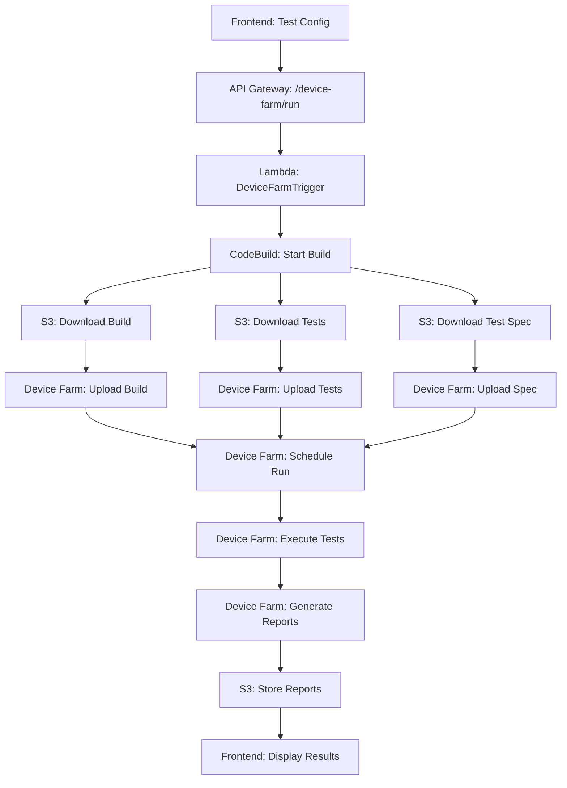
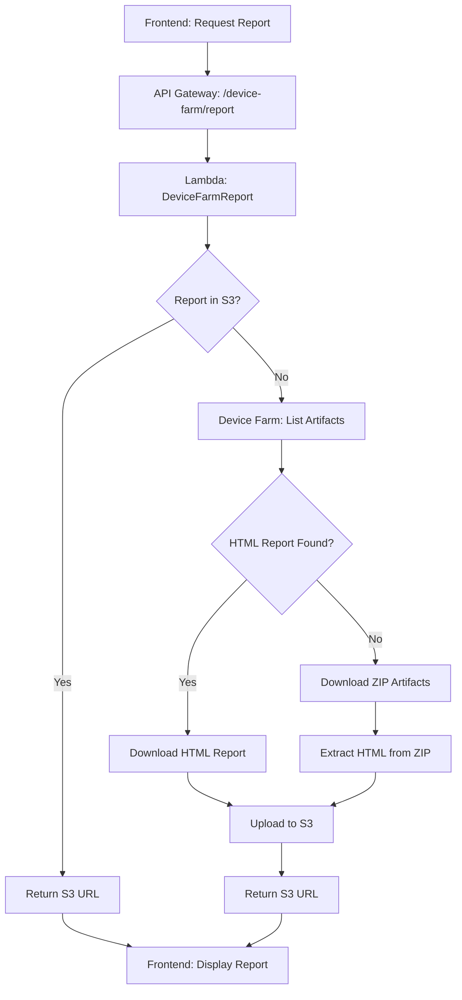
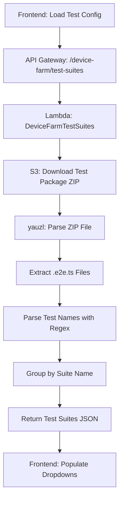

# Vault22 Test Runner - Technical Architecture

## System Overview

The Vault22 Test Runner is a serverless, event-driven architecture that orchestrates mobile application testing across local environments and AWS Device Farm. The system is designed for scalability, cost-effectiveness, and ease of maintenance.

## Architecture Principles

1. **Serverless-First**: No infrastructure management, pay-per-use model
2. **Event-Driven**: Asynchronous communication between services  
3. **Stateless**: Each request is independent, state stored in S3/DynamoDB
4. **Microservices**: Single-purpose Lambda functions with clear boundaries
5. **Infrastructure as Code**: All resources defined in CDK

## Core Components

### Frontend Layer
```
┌─────────────────────────────────────────────────────────────┐
│                    Frontend (Next.js)                      │
│                                                             │
│  ┌─────────────────┐  ┌─────────────────┐  ┌──────────────┐ │
│  │ Test Config     │  │ Test History    │  │ Running Tests│ │
│  │ Component       │  │ Component       │  │ Component    │ │
│  └─────────────────┘  └─────────────────┘  └──────────────┘ │
│                                                             │
│  • React components with real-time updates                 │
│  • Environment detection (local vs AWS)                    │
│  • Dynamic test suite loading                             │
│  • S3-hosted static website                               │
└─────────────────────────────────────────────────────────────┘
```

### API Gateway Layer
```
┌─────────────────────────────────────────────────────────────┐
│                     API Gateway (REST)                     │
│                                                             │
│  ┌─────────────────┐  ┌─────────────────┐  ┌──────────────┐ │
│  │ /device-farm/*  │  │ /test/*         │  │ /builds/*    │ │
│  │ • run           │  │ • history       │  │ • list       │ │
│  │ • status        │  │ • run           │  │ • fetch      │ │
│  │ • devices       │  │                 │  │              │ │
│  │ • report        │  │                 │  │              │ │
│  │ • test-suites   │  │                 │  │              │ │
│  └─────────────────┘  └─────────────────┘  └──────────────┘ │
│                                                             │
│  • CORS enabled for all origins                           │
│  • Request/Response transformation                        │
│  • Authentication & rate limiting ready                   │
└─────────────────────────────────────────────────────────────┘
```

### Lambda Functions Layer
```
┌─────────────────────────────────────────────────────────────┐
│                    Lambda Functions                        │
│                                                             │
│  ┌─────────────────┐  ┌─────────────────┐  ┌──────────────┐ │
│  │ Device Farm     │  │ Test Management │  │ Build Mgmt   │ │
│  │ • Trigger       │  │ • History       │  │ • List       │ │
│  │ • Status        │  │ • Local Run     │  │ • Fetch      │ │
│  │ • Devices       │  │ • Upload        │  │              │ │
│  │ • Report        │  │                 │  │              │ │
│  │ • Sync          │  │                 │  │              │ │
│  │ • Test Suites   │  │                 │  │              │ │
│  └─────────────────┘  └─────────────────┘  └──────────────┘ │
│                                                             │
│  • Node.js 22.x runtime                                   │
│  • Environment-specific configuration                     │
│  • Shared utilities and AWS SDK clients                   │
└─────────────────────────────────────────────────────────────┘
```

### Storage Layer
```
┌─────────────────────────────────────────────────────────────┐
│                       S3 Buckets                           │
│                                                             │
│  ┌─────────────────┐  ┌─────────────────┐  ┌──────────────┐ │
│  │ vault22-builds  │  │ vault22-tests   │  │ vault22-     │ │
│  │ • APK files     │  │ • ZIP packages  │  │ test-reports │ │
│  │ • IPA files     │  │ • Test specs    │  │ • HTML files │ │
│  │ • Private       │  │ • Private       │  │ • Public     │ │
│  └─────────────────┘  └─────────────────┘  └──────────────┘ │
│                                                             │
│  ┌─────────────────────────────────────────────────────────┐ │
│  │              vault22-test-runner-ui                    │ │
│  │              • Static website hosting                 │ │
│  │              • Next.js build artifacts                │ │
│  │              • Public read access                     │ │
│  └─────────────────────────────────────────────────────────┘ │
└─────────────────────────────────────────────────────────────┘
```

### Execution Layer
```
┌─────────────────────────────────────────────────────────────┐
│                  Execution Services                        │
│                                                             │
│  ┌─────────────────┐                    ┌─────────────────┐ │
│  │   CodeBuild     │                    │  Device Farm    │ │
│  │                 │                    │                 │ │
│  │ • Download      │ ──── Uploads ────► │ • iOS Devices   │ │
│  │   artifacts     │      to Device     │ • Android       │ │
│  │ • Build Node.js │      Farm          │   Devices       │ │
│  │   environment   │                    │ • Real devices  │ │
│  │ • Execute       │ ◄──── Results ──── │ • Test reports  │ │
│  │   Device Farm   │       from         │ • Artifacts     │ │
│  │   SDK calls     │       Device       │ • Screenshots   │ │
│  │                 │       Farm         │ • Logs          │ │
│  └─────────────────┘                    └─────────────────┘ │
└─────────────────────────────────────────────────────────────┘
```

## Service Communication Patterns

### 1. Request-Response Pattern (Synchronous)

Used for immediate data retrieval and simple operations.

```typescript
// Frontend → API Gateway → Lambda → Response
const response = await fetch(`${API_URL}/api/builds`);
const builds = await response.json();
```

**Flow:**
1. Frontend makes HTTP request
2. API Gateway routes to appropriate Lambda
3. Lambda processes request (S3 calls, etc.)
4. Response returned synchronously
5. Frontend updates UI

**Used for:**
- Listing builds, tests, devices
- Getting test status
- Fetching test history

### 2. Trigger-and-Monitor Pattern (Asynchronous)

Used for long-running operations like test execution.

```typescript
// 1. Trigger test execution
const runResponse = await fetch(`${API_URL}/api/device-farm/run`, {
  method: 'POST',
  body: JSON.stringify(testConfig)
});

// 2. Monitor progress with polling
const checkStatus = async () => {
  const statusResponse = await fetch(`${API_URL}/api/device-farm/running`);
  const runningTests = await statusResponse.json();
  // Update UI with current status
};

setInterval(checkStatus, 5000); // Poll every 5 seconds
```

**Flow:**
1. Frontend triggers long-running operation
2. Lambda starts async process (CodeBuild)
3. Frontend polls for status updates
4. Backend reports progress
5. Frontend shows real-time updates

**Used for:**
- Device Farm test execution
- Build fetching from external sources
- Large file uploads

### 3. Event-Driven Pattern (Background Processing)

Used for automated tasks and cleanup operations.

```typescript
// Background sync of completed tests
export const handler = async (event) => {
  // Triggered by CloudWatch Events or manual calls
  const completedRuns = await deviceFarm.listRuns({
    projectArn,
    filter: { status: 'COMPLETED' }
  });
  
  // Process each completed run
  for (const run of completedRuns) {
    await processTestResults(run);
  }
};
```

**Flow:**
1. Event triggers Lambda execution
2. Lambda performs background work
3. Results stored in S3 or database
4. Frontend retrieves updated data on next request

**Used for:**
- Syncing completed test results
- Cleaning up temporary files
- Generating consolidated reports

## Data Flow Architecture

### Test Execution Data Flow



### Report Generation Data Flow



### Dynamic Test Suites Data Flow



## Security Architecture

### Authentication & Authorization

```
┌─────────────────────────────────────────────────────────────┐
│                    Security Layers                         │
│                                                             │
│  ┌─────────────────────────────────────────────────────────┐ │
│  │                 API Gateway                            │ │
│  │  • CORS policies                                      │ │
│  │  • Rate limiting (configurable)                       │ │
│  │  • API keys (future enhancement)                      │ │
│  └─────────────────────────────────────────────────────────┘ │
│                             │                               │
│  ┌─────────────────────────────────────────────────────────┐ │
│  │                Lambda Functions                        │ │
│  │  • IAM execution roles                                │ │
│  │  • Principle of least privilege                       │ │
│  │  • Environment variable encryption                    │ │
│  └─────────────────────────────────────────────────────────┘ │
│                             │                               │
│  ┌─────────────────────────────────────────────────────────┐ │
│  │                   S3 Buckets                          │ │
│  │  • Private buckets (builds, tests)                    │ │
│  │  • Public read only (reports, UI)                     │ │
│  │  • Bucket policies                                    │ │
│  └─────────────────────────────────────────────────────────┘ │
└─────────────────────────────────────────────────────────────┘
```

### IAM Roles & Policies

```typescript
// Example: CodeBuild IAM Role
const deviceFarmCodeBuildRole = new iam.Role(this, 'DeviceFarmCodeBuildRole', {
  assumedBy: new iam.ServicePrincipal('codebuild.amazonaws.com'),
  inlinePolicies: {
    DeviceFarmPolicy: new iam.PolicyDocument({
      statements: [
        new iam.PolicyStatement({
          effect: iam.Effect.ALLOW,
          actions: [
            'devicefarm:*',
            'logs:CreateLogGroup',
            'logs:CreateLogStream', 
            'logs:PutLogEvents',
            's3:GetObject',
            's3:PutObject'
          ],
          resources: ['*'] // Scoped in production
        })
      ]
    })
  }
});
```

## Scalability Considerations

### Horizontal Scaling
- **Lambda Functions**: Auto-scale based on demand, 1000 concurrent executions by default
- **API Gateway**: Handles 10,000 requests/second by default, can be increased
- **S3**: Virtually unlimited storage and bandwidth
- **Device Farm**: Limited by available device pools, can request increases

### Vertical Scaling
- **Lambda Memory**: Configurable from 128MB to 10,240MB
- **Lambda Timeout**: Up to 15 minutes for long operations
- **CodeBuild**: Different compute types (small, medium, large, xlarge)

### Cost Optimization
- **Lambda**: Pay per request and execution time
- **S3**: Intelligent tiering for infrequently accessed files
- **API Gateway**: Caching to reduce Lambda invocations
- **Device Farm**: Pay per device minute, optimize test execution time

## Monitoring & Observability

### CloudWatch Integration

```typescript
// Automatic CloudWatch integration
const lambda = new lambda.Function(this, 'MyFunction', {
  // ... configuration
  environment: {
    LOG_LEVEL: 'INFO'
  }
});

// Custom metrics (example)
await cloudWatch.putMetricData({
  Namespace: 'Vault22/TestRunner',
  MetricData: [{
    MetricName: 'TestExecutionDuration',
    Value: duration,
    Unit: 'Seconds',
    Dimensions: [{
      Name: 'Platform',
      Value: 'Android'
    }]
  }]
}).promise();
```

### Logging Strategy

```typescript
// Structured logging in Lambda functions
const log = (level, message, context = {}) => {
  console.log(JSON.stringify({
    timestamp: new Date().toISOString(),
    level,
    message,
    requestId: process.env.AWS_REQUEST_ID,
    ...context
  }));
};

// Usage
log('INFO', 'Starting Device Farm test', { 
  runArn: 'arn:aws:devicefarm:...',
  platform: 'android' 
});
```

### Health Checks & Alerting

```typescript
// Health check endpoint
export const handler = async (event) => {
  const checks = {
    s3: await checkS3Health(),
    deviceFarm: await checkDeviceFarmHealth(),
    builds: await checkBuildsAvailable()
  };
  
  const allHealthy = Object.values(checks).every(check => check.healthy);
  
  return {
    statusCode: allHealthy ? 200 : 503,
    body: JSON.stringify({
      status: allHealthy ? 'healthy' : 'unhealthy',
      checks,
      timestamp: new Date().toISOString()
    })
  };
};
```

## Error Handling & Resilience

### Retry Strategies

```typescript
// Exponential backoff for Device Farm calls
const retryWithBackoff = async (operation, maxRetries = 3) => {
  for (let attempt = 1; attempt <= maxRetries; attempt++) {
    try {
      return await operation();
    } catch (error) {
      if (attempt === maxRetries) throw error;
      
      const delay = Math.pow(2, attempt) * 1000; // 2s, 4s, 8s
      await new Promise(resolve => setTimeout(resolve, delay));
    }
  }
};
```

### Circuit Breaker Pattern

```typescript
class CircuitBreaker {
  constructor(threshold = 5, timeout = 60000) {
    this.failureThreshold = threshold;
    this.timeout = timeout;
    this.failureCount = 0;
    this.lastFailureTime = null;
    this.state = 'CLOSED'; // CLOSED, OPEN, HALF_OPEN
  }
  
  async execute(operation) {
    if (this.state === 'OPEN') {
      if (Date.now() - this.lastFailureTime > this.timeout) {
        this.state = 'HALF_OPEN';
      } else {
        throw new Error('Circuit breaker is OPEN');
      }
    }
    
    try {
      const result = await operation();
      this.onSuccess();
      return result;
    } catch (error) {
      this.onFailure();
      throw error;
    }
  }
  
  onSuccess() {
    this.failureCount = 0;
    this.state = 'CLOSED';
  }
  
  onFailure() {
    this.failureCount++;
    this.lastFailureTime = Date.now();
    
    if (this.failureCount >= this.failureThreshold) {
      this.state = 'OPEN';
    }
  }
}
```

### Graceful Degradation

```typescript
// Fallback to hardcoded test suites if S3 fails
export const getTestSuites = async () => {
  try {
    return await fetchTestSuitesFromS3();
  } catch (error) {
    log('WARN', 'Failed to fetch test suites from S3, using fallback', { error });
    
    return {
      'Login Flow': [
        'Should login successfully with valid credentials',
        'Should show error for invalid credentials'
      ],
      'Registration': [
        'Should register new user successfully',
        'Should validate email format'
      ]
    };
  }
};
```

## Performance Optimization

### Lambda Cold Start Mitigation

```typescript
// Keep connections alive between invocations
let s3Client;
let deviceFarmClient;

export const handler = async (event) => {
  // Initialize clients only once
  if (!s3Client) {
    s3Client = new S3Client({
      region: process.env.AWS_REGION,
      maxAttempts: 3
    });
  }
  
  if (!deviceFarmClient) {
    deviceFarmClient = new DeviceFarmClient({
      region: 'us-west-2', // Device Farm is only in us-west-2
      maxAttempts: 3
    });
  }
  
  // Process request...
};
```

### Caching Strategies

```typescript
// In-memory caching for frequently accessed data
const cache = new Map();
const CACHE_TTL = 5 * 60 * 1000; // 5 minutes

const getCachedData = async (key, fetchFunction) => {
  const cached = cache.get(key);
  
  if (cached && Date.now() - cached.timestamp < CACHE_TTL) {
    return cached.data;
  }
  
  const data = await fetchFunction();
  cache.set(key, {
    data,
    timestamp: Date.now()
  });
  
  return data;
};

// Usage
const devices = await getCachedData('android-devices', () => 
  deviceFarm.listDevices({ platform: 'ANDROID' })
);
```

### S3 Performance

```typescript
// Multipart upload for large files
const uploadLargeFile = async (bucket, key, body) => {
  if (body.length < 100 * 1024 * 1024) { // < 100MB
    return s3.upload({ Bucket: bucket, Key: key, Body: body }).promise();
  }
  
  // Use multipart upload for large files
  const multipartUpload = await s3.createMultipartUpload({
    Bucket: bucket,
    Key: key
  }).promise();
  
  const partSize = 10 * 1024 * 1024; // 10MB parts
  const parts = [];
  
  for (let i = 0; i < body.length; i += partSize) {
    const partBody = body.slice(i, i + partSize);
    const partNumber = Math.floor(i / partSize) + 1;
    
    const part = await s3.uploadPart({
      Bucket: bucket,
      Key: key,
      PartNumber: partNumber,
      UploadId: multipartUpload.UploadId,
      Body: partBody
    }).promise();
    
    parts.push({
      ETag: part.ETag,
      PartNumber: partNumber
    });
  }
  
  return s3.completeMultipartUpload({
    Bucket: bucket,
    Key: key,
    UploadId: multipartUpload.UploadId,
    MultipartUpload: { Parts: parts }
  }).promise();
};
```

This architecture documentation provides a comprehensive view of how all components interact, communicate, and scale within the Vault22 Test Runner system.