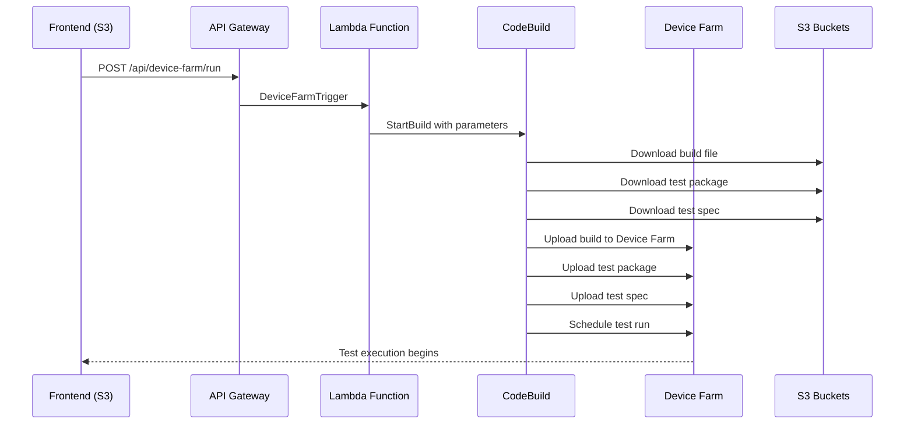
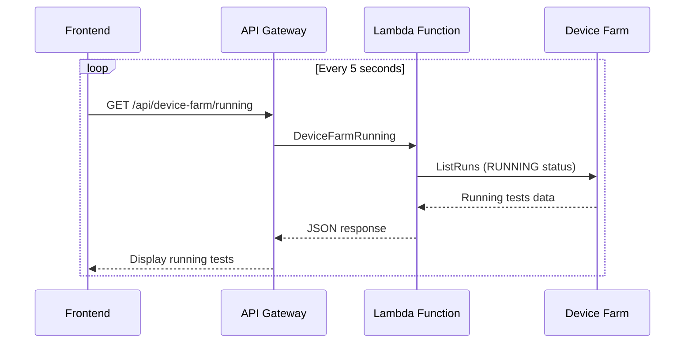
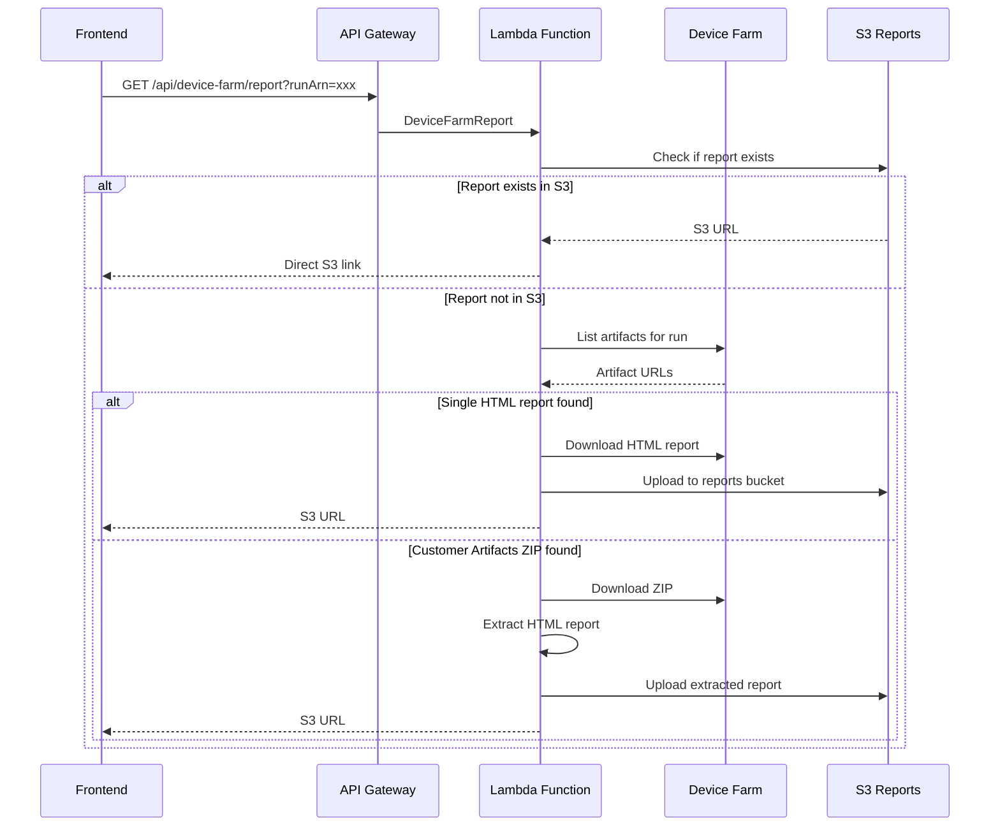
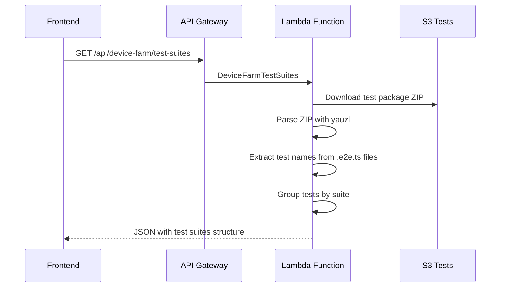

# Vault22 Test Runner - Complete Deployment Guide

## 🚀 Quick Start

**Deploy in 2 minutes:**

```bash
# 1. Set AWS credentials
export AWS_ACCESS_KEY_ID="your_access_key"
export AWS_SECRET_ACCESS_KEY="your_secret_key"
export AWS_SESSION_TOKEN="your_session_token"

# 2. Deploy everything
./deploy.sh

# 3. Visit your app
open http://vault22-test-runner-ui.s3-website-eu-west-1.amazonaws.com
```

## Overview

The Vault22 Test Runner is a serverless application that orchestrates mobile app testing using AWS Device Farm. It consists of:

- **Frontend**: Next.js React application hosted on S3
- **Backend**: AWS Lambda functions orchestrated via API Gateway
- **Test Orchestration**: CodeBuild + Device Farm integration
- **Storage**: S3 buckets for builds, tests, and reports

## Architecture Diagram

```
┌─────────────────┐    ┌──────────────────┐    ┌─────────────────┐
│   Frontend      │    │   API Gateway    │    │   Lambda        │
│   (S3 Static)   ├────┤   (REST API)     ├────┤   Functions     │
│                 │    │                  │    │                 │
└─────────────────┘    └──────────────────┘    └─────────────────┘
                                │                        │
                                │                        │
┌─────────────────┐    ┌──────────────────┐    ┌─────────────────┐
│   S3 Buckets    │    │   CodeBuild      │    │   Device Farm   │
│   - Builds      │    │   (Test Runner)  │    │   (iOS/Android) │
│   - Tests       │◄───┤                  ├────┤                 │
│   - Reports     │    │                  │    │                 │
└─────────────────┘    └──────────────────┘    └─────────────────┘
```

## Prerequisites

### AWS Account Setup
```bash
# Install AWS CLI
# Configure with appropriate permissions for:
# - S3 (full access)
# - Lambda (full access) 
# - API Gateway (full access)
# - CodeBuild (full access)
# - Device Farm (full access)
# - IAM (role creation)
# - CloudFormation (full access)

# Set environment variables
export AWS_ACCESS_KEY_ID="your-access-key"
export AWS_SECRET_ACCESS_KEY="your-secret-key"
export AWS_SESSION_TOKEN="your-session-token"  # if using temporary credentials
```

### Node.js & CDK Setup
```bash
# Install Node.js 18+
# Install AWS CDK
npm install -g aws-cdk

# Install project dependencies
cd aws-infrastructure && npm install
cd ../test-runner-ui && npm install
cd ../lambda && npm install
```

## Deployment Process

### ⚡ Quick Deployment (Recommended)

**One-command deployment:**

```bash
# Set your AWS credentials first
export AWS_ACCESS_KEY_ID="your_access_key"
export AWS_SECRET_ACCESS_KEY="your_secret_key"  
export AWS_SESSION_TOKEN="your_session_token"  # if using temporary credentials

# Deploy everything with one command
./deploy.sh
```

This script will:
1. ✅ Check prerequisites (AWS CLI, Node.js, CDK)
2. 🏗️ Deploy backend infrastructure (Lambda, API Gateway, S3)
3. 📦 Install all dependencies
4. 🎨 Build and deploy frontend with correct API URLs
5. 🔍 Verify deployment and provide summary

### 📋 Manual Deployment (Advanced)

If you prefer manual control or need to troubleshoot:

**What gets deployed:**

#### S3 Buckets:
- `vault22-builds` - Stores APK/IPA build files
- `vault22-tests` - Stores test packages (ZIP files)
- `vault22-test-reports` - Hosts HTML test reports (public read)
- `vault22-test-runner-ui` - Hosts frontend static files

#### Lambda Functions:
- `DeviceFarmTrigger` - Triggers CodeBuild for Device Farm tests
- `DeviceFarmStatus` - Monitors test execution status
- `DeviceFarmDevices` - Manages device pools and configurations
- `DeviceFarmSync` - Syncs completed test results to history
- `DeviceFarmRunning` - Gets currently running tests
- `DeviceFarmReport` - Handles test report generation and S3 upload
- `DeviceFarmTestSuites` - Extracts test suites from ZIP packages
- `TestHistory` - Manages local and Device Farm test history
- `Builds` - Lists available app builds
- `BuildsFetch` - Downloads builds from external sources
- `Tests` - Lists available test packages
- `TestsUpload` - Uploads test packages
- `TestRun` - Manages local test execution

#### CodeBuild Project:
- `vault22-device-farm-upload` - Handles Device Farm test orchestration
  - Downloads app build from S3
  - Downloads test package from S3
  - Downloads test spec from S3
  - Uploads all to Device Farm
  - Schedules test run with environment variables

#### API Gateway:
- REST API with CORS enabled
- Routes map to Lambda functions

### 2. Test Package Deployment

Test packages must be uploaded to S3 before running tests.

```bash
# Upload WebDriverIO test package
aws s3 cp device-farm-test-package.zip s3://vault22-tests/

# Upload test specification
aws s3 cp device-farm-testspec.yml s3://vault22-tests/

# Verify uploads
aws s3 ls s3://vault22-tests/
```

**Test Package Structure:**
```
device-farm-test-package.zip
├── test/
│   └── e2e/
│       ├── login.e2e.ts
│       ├── registration.e2e.ts
│       └── ...
├── package.json
├── wdio.conf.js
└── node_modules/
```

### 3. Frontend Deployment

The frontend is a Next.js application deployed as static files to S3.

```bash
cd /path/to/vault22-testing/test-runner-ui

# Set the API URL from CDK output
export API_URL="https://zis3j10xnc.execute-api.eu-west-1.amazonaws.com/prod"

# Build with production API URL
NEXT_PUBLIC_API_URL=$API_URL npm run build

# Deploy static assets
aws s3 sync .next/static s3://vault22-test-runner-ui/_next/static

# Deploy server-side rendered pages (excluding API routes)
aws s3 sync .next/server/app s3://vault22-test-runner-ui/ --exclude "**/route.*"

# Verify deployment
aws s3 ls s3://vault22-test-runner-ui/
```

### 4. App Build Upload

Mobile app builds must be available in the builds bucket.

```bash
# Upload APK/IPA files
aws s3 cp your-app.apk s3://vault22-builds/android/
aws s3 cp your-app.ipa s3://vault22-builds/ios/

# Or use the fetch endpoint to download from external sources
curl -X POST "$API_URL/api/builds/fetch"
```

## Service Communication Flow

### 1. Test Execution Flow



### 2. Test Monitoring Flow



### 3. Report Generation Flow



### 4. Dynamic Test Suites Flow



## Environment Configuration

### CDK Environment Variables
```typescript
// In aws-infrastructure/lib/test-runner-stack.ts
environmentVariables: {
  DEVICE_FARM_PROJECT_ARN: {
    value: process.env.DEVICE_FARM_PROJECT_ARN || 'default-arn'
  },
  BUILDS_BUCKET_NAME: {
    value: buildsBucket.bucketName
  },
  TESTS_BUCKET_NAME: {
    value: testsBucket.bucketName
  }
}
```

### Lambda Environment Variables
```typescript
// Lambda functions receive:
CUSTOM_AWS_ACCESS_KEY_ID
CUSTOM_AWS_SECRET_ACCESS_KEY  
CUSTOM_AWS_SESSION_TOKEN
TESTS_BUCKET_NAME
BUILDS_BUCKET_NAME
```

### Frontend Environment Variables
```bash
# Build time
NEXT_PUBLIC_API_URL=https://api-gateway-url/prod

# Runtime detection
const isAWSDeployment = Boolean(process.env.NEXT_PUBLIC_API_URL);
```

## API Endpoints Reference

### Device Farm Endpoints
- `POST /api/device-farm/run` - Start Device Farm test
- `GET /api/device-farm/status` - Get test status
- `GET /api/device-farm/running` - Get running tests
- `GET /api/device-farm/sync` - Sync completed tests
- `GET /api/device-farm/report` - Get test report
- `GET /api/device-farm/devices` - List available devices
- `GET /api/device-farm/test-suites` - Get dynamic test suites

### Build Management
- `GET /api/builds` - List available builds
- `POST /api/builds/fetch` - Fetch builds from external source

### Test Management  
- `GET /api/tests` - List test packages
- `POST /api/tests/upload` - Upload test package

### History & Local Tests
- `GET /api/test/history` - Get test history
- `POST /api/test/run` - Run local tests

## Monitoring & Debugging

### CloudWatch Logs
Each Lambda function has its own log group:
- `/aws/lambda/TestRunnerStack-DeviceFarmTrigger-xxx`
- `/aws/lambda/TestRunnerStack-DeviceFarmReport-xxx`
- etc.

### CodeBuild Logs
- Project: `vault22-device-farm-upload`
- CloudWatch Log Group: `/aws/codebuild/vault22-device-farm-upload`

### S3 Access Logs
Reports bucket supports public access for direct HTML viewing:
```
https://vault22-test-reports.s3.eu-west-1.amazonaws.com/allure/device-farm-{runId}.html
```

## Security Considerations

### IAM Roles & Policies
- Lambda execution roles have minimal required permissions
- S3 buckets use principle of least privilege
- CodeBuild role has Device Farm and S3 access only

### CORS Configuration
```typescript
defaultCorsPreflightOptions: {
  allowOrigins: apigateway.Cors.ALL_ORIGINS,
  allowMethods: apigateway.Cors.ALL_METHODS,
  allowHeaders: ['Content-Type', 'Authorization', 'X-Requested-With']
}
```

### Public Access
Only the reports bucket (`vault22-test-reports`) allows public read access for HTML report viewing.

## Troubleshooting

### Common Issues

1. **Build Failures**
   ```bash
   # Check CodeBuild logs
   aws logs describe-log-groups --log-group-name-prefix "/aws/codebuild/vault22"
   ```

2. **Lambda Timeouts**
   ```bash
   # Check Lambda logs
   aws logs describe-log-groups --log-group-name-prefix "/aws/lambda/TestRunnerStack"
   ```

3. **S3 Upload Issues**
   ```bash
   # Verify bucket policies
   aws s3api get-bucket-policy --bucket vault22-test-reports
   ```

4. **Frontend Loading Issues**
   ```bash
   # Check S3 website configuration
   aws s3api get-bucket-website --bucket vault22-test-runner-ui
   ```

### Health Checks
```bash
# Test API Gateway
curl $API_URL/api/builds

# Test S3 website
curl http://vault22-test-runner-ui.s3-website-eu-west-1.amazonaws.com

# Test reports bucket
curl https://vault22-test-reports.s3.eu-west-1.amazonaws.com/
```

## Cleanup

To remove all resources:

```bash
cd aws-infrastructure
cdk destroy

# Manual cleanup if needed
aws s3 rm s3://vault22-builds --recursive
aws s3 rm s3://vault22-tests --recursive  
aws s3 rm s3://vault22-test-reports --recursive
aws s3 rm s3://vault22-test-runner-ui --recursive
```

## Version Management

### Backend Updates
```bash
# Deploy infrastructure changes
cd aws-infrastructure
cdk deploy

# Lambda code updates are automatically deployed with CDK
```

### Frontend Updates
```bash
# Rebuild and redeploy (IMPORTANT: Clean build to avoid hash mismatches)
cd test-runner-ui
rm -rf .next dist  # Clean previous builds
NEXT_PUBLIC_API_URL=$API_URL npm run build

# Clear S3 bucket to avoid file conflicts
aws s3 rm s3://vault22-test-runner-ui --recursive --exclude "*.ico"

# Deploy with correct content types
aws s3 sync .next/static s3://vault22-test-runner-ui/_next/static --delete
aws s3 sync .next/server/app s3://vault22-test-runner-ui/ --exclude "**/route.*" --delete

# Fix content types for proper browser loading
aws s3 cp s3://vault22-test-runner-ui/_next/static/css/ s3://vault22-test-runner-ui/_next/static/css/ --recursive --content-type "text/css" --metadata-directive REPLACE
aws s3 cp s3://vault22-test-runner-ui/_next/static/chunks/ s3://vault22-test-runner-ui/_next/static/chunks/ --recursive --content-type "application/javascript" --metadata-directive REPLACE
```

### Test Package Updates
```bash
# Upload new test package
aws s3 cp device-farm-test-package.zip s3://vault22-tests/
```

This completes the comprehensive deployment documentation for the Vault22 Test Runner system.